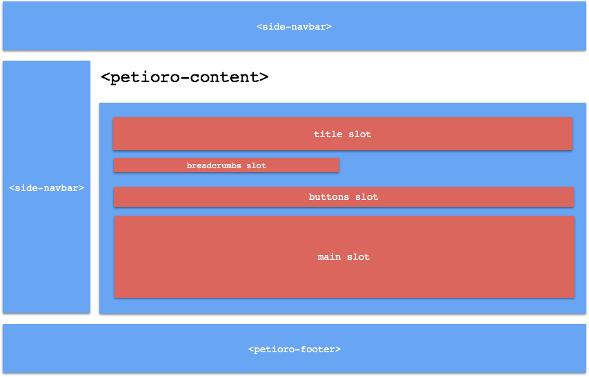

Petioro - Sistema Controle de PetShop
-------------------------------------

Criado por 
    | Lais Helena Chiachio de Miranda **NºUSP 8517032**
    | Leonardo Sampaio Ferraz Ribeiro **NºUSP 8532300**
    | Sabrina Faceroli Tridico        **NºUSP 9066452**

Todos os serviços foram implementados completamente no cliente utilizando o framework
de Polyfills para WebComponents Polymer 2.0 e Javascript ES6. As operações asíncronas, em grande maioria, 
foram implementadas utilizando ``Promise`` s do ES6.

Os WebComponents podem ser encontrados na pasta ``elements/``, os arquivos de estilo na pasta
``css/``, modelos na pasta ``models/``, templates na pasta ``templates/`` e os principais scripts
na pasta ``scripts/``.

O aplicativo foi arquitetado como um Single Page Application e o gerenciamento do conteúdo
implementado na classe ``Router``, no arquivo ``scripts/router.js``. Este é o código mais
complexo do sistema, gerenciando as mudanças de conteúdo com base nas mudanças na URL e em
requisições de "actions" por todo o sistema. No diagrama abaixo é possível ver como a estrutura
foi construída:

As partes em azul representam o "shell" do sistema, e são carregados apenas uma vez. O restante
é carregado *on-the-fly* com base no conteúdo da hash URL (URL depois do símbolo #).

Views e Actions
.....................................

O comportamento do ``Router`` utiliza de dois conceitos criados para estruturar o código 
do projeto com base em funcionalidades, ``actions`` e ``actions``. O router utiliza do 
*Event Loop* para oferece dois métodos importantes utilizados para seguir esta estrutura.

Views
'''''''''''''''''''''''''''''''''''''

Todas as ``views`` do sistema estão definidas no arquivo ``scripts/views.js``. Uma ``view`` é uma função que
define o conteúdo que deve aparecer na tela dada que certa rota foi encontrada na hash URL. 

As ``views`` são definidas utilizando o método do ``Router`` ``viewForRoute("admin/admins", view)``. 
Em geral, cada ``view`` segue o mesmo modelo de fluxo de *(1)* Renderizar o template correto na tela, *(2)*
buscar dados necessários para preencher o template e *(3)* Unir ambos. Um exemplo simples é a lista de 
clientes cadastrados::

    router.viewForRoute("admin/clients", () => {
        router.getTemplate("admin/clients/index.html").then((response) => {
            return Promise.all([router.renderAdmin(response), Client.getAll()]);
        }).then((results) => {
            let content = results[0];
            let clients = results[1];
            content.querySelector('clients-table').clients = clients;
        })
    })

As ``views`` também podem receber parâmetros contidos na URL e, de modo geral, se assemelham a um
HTTP GET.

Actions
'''''''''''''''''''''''''''''''''''''

Todas as ``actions`` do sistema estão definidas no arquivo ``scripts/actions.js``. Uma ``action`` é uma função que
é executada quando algum componente precisa executar código relacionado à lógica de negócios.

As ``actions`` são definidas utilizando o método do ``Router`` ``actionForRoute("admin/admins", action)``. 

Assim como o ``views``, ``actions`` podem receber parâmetros, mas estes não são encodados na URL e podem conter um
objeto completo, chamado de ``model``. Um destque especial para o uso de ``actions`` está no componente 
``<petioro-form>``, que automaticamente invoca uma ação quando o usuário deseja submeter o formulário. Seguindo o
mesmo exemplo, o componente foi usado da seguinte forma no template de formulário de cliente::

    <petioro-form action="admin/clients">

E a ``action`` correspondente é executada `on-submit`::

    router.actionForRoute("admin/clients", (parameters) => {
        let newModel = new Client(parameters.model);
        if (parameters.id !== null && parameters.id !== undefined) {
            Client.update(parameters.id, newModel).then(() => {
                location.href='#admin/clients';
            });
        } else {
            Client.create(newModel).then(() => {
                location.href='#admin/clients';
            });
        }
    })

Templates
'''''''''''''''''''''''''''''''''''''

Os templates são pequenas porções de HTML utilizadas pelo ``router`` para carregar partes
da página. Eles são renderizados por chamadas ao método do ``router`` ``getTemplate(path)`` dentro das ``views``. 
Os templates que definem a base/shell da aplicação são ``templates/client/base.html`` e ``templates/admin/base.html``.

Models
.....................................

Os modelos definem a comunicação com o ``IndexedDB``, as estruturas de dados e a lógica de negócios do sistema. 

